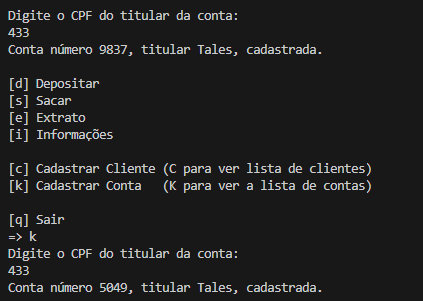

# Desafio Banco POO
Resultado do desafio de POO do Curso de Engenharia de Dados do DIO

Criamos um sistema bancário utilizando as classes indicadas no seguinte diagrama:

O programa inicializa instanciando a classe Banco, que é uma filha das classes Contas e Clientes.

Toda a lógica de saques e depósitos foi jogada para o interior das classes Saque, Deposito, e Contas. 

A criação de um novo cliente só pode ser feita pelo método Banco.cadastrarCliente(), chamada pelo menu principal.

Tal método já faz as checagens necessárias para o cadastro, verificando se os dados estão no formato correto e se há cliente já cadastrado com aquele CPF. 

Se já há um cadastro com aquele CPF:

A criação de uma nova conta também deve ser feito por um método da classe Banco. Tal método simplesmente pede pelo CPF do usuário, e fornece uma conta identificada por 4 dígitos aleatórios se o usuário já é cliente do banco. Cada usuário pode ter um número ilimitado de contas.

Sucesso:

Não está cadastrado no Banco:

A função de saque e depósito inicia pedindo a identificação da conta pelo número. Nessa versão do programa, não há restrição de acesso, desde que informe o número correto. Caso a conta exista no banco de dados do banco, ele prossegue para efetuar o depósito e o saque, respeitadas as limitações estipuladas na lógica de cada objeto do tipo conta.

Depósito:

Saque:

Exemplo de erro ao sacar:

A opção extrato meramente imprime as transações efetuadas por uma dada conta. Ela pede pelo número da conta e usa um método da própria classe Conta.

